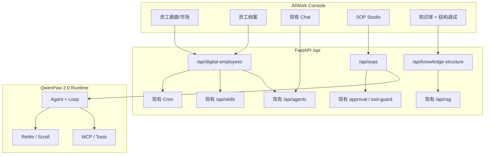

# AIWork-OS × StaffDeck 能力融合 — 详细开发文档

| 项 | 内容 |
|----|------|
| 文档版本 | v1.0 |
| 日期 | 2026-07-23 |
| 状态 | 待评审 / 可立项 |
| 依据 | StaffDeck 功能分析与融合建议 |
| 目标平台 | AIWork-OS（同仓 QwenPaw 2.0 内核 + Console） |
| 许可约束 | **禁止**将 StaffDeck（AGPL-3.0）源码并入商用发行；仅吸收产品能力与交互范式 |

---

## 1. 背景与目标

### 1.1 背景

StaffDeck（OpenBMB 开源「企业数字员工」平台）在以下方面形成差异化：

1. **数字员工一等公民**：岗位、工号、能力画像、工作记录、市场/画廊、发布复用  
2. **状态机驱动的 SOP 技能**：自然语言 → 结构化流程；可视化编辑、版本与分支  
3. **文档结构感知检索**：章/节/页级索引、引用溯源、检索调试  
4. **运行中人机协同**：完整轨迹、人工接管、反馈闭环  

AIWork-OS 已具备：多 Agent、Skills/MCP、Cron、RAG/素材库、JWT/RBAC/部门、频道、Tool Guard/Governance、Console。

### 1.2 目标（一句话）

在 **不引入 StaffDeck 源码** 的前提下，把「数字员工运营壳 → SOP 状态机 → 结构化知识与人接班」分三期落到 AIWork-OS，使平台从「能对话的 Agent」升级为「可编制、可流程化、可审计的数字员工体系」。

### 1.3 成功标准（产品）

- 业务方可按「岗位/编制」创建与发布数字员工，而不仅是技术侧的 Agent ID  
- 关键 SOP 可以状态机方式执行，关键节点可人工确认，执行过程可回放  
- 知识问答可展示文档结构路径与原文引用  
- 运行中可接管；结束后可沉淀反馈  

### 1.4 非目标（本期明确不做）

- 不合并 StaffDeck Git 仓库 / 不复用其 AGPL 代码  
- 不替换现有 Agent 内核与频道体系  
- 不一次性重做全部 Console  
- 不做多数字员工群聊编排（可作为远期，对标 StaffDeck Roadmap）

---

## 2. 设计原则

| 原则 | 说明 |
|------|------|
| 能力吸收，代码隔离 | 只借鉴能力与 UX；实现落在 `src/aiwork` + `console` |
| 薄映射、厚复用 | 数字员工 = Agent 的产品投影；底层仍用现有 workspace/agent |
| 企业区隔离 | 新代码集中在约定前缀，便于跟上游 QwenPaw 同步 |
| API 稳定 | 新 API 挂在 `/api/digital-employees`、`/api/sops`、`/api/knowledge-structure` 等命名空间 |
| 可渐进上线 | 每期独立可验收、可灰度，不阻塞现有 Chat/素材库 |

### 2.1 推荐代码落点（企业安全改动区）

```text
src/aiwork/
  digital_employee/          # 数字员工领域模型与服务
  sop/                       # SOP 状态机（二期）
  knowledge_structure/       # 结构索引（三期，可挂在 rag 旁）
  app/routers/
    digital_employees.py
    sops.py
    knowledge_structure.py
console/src/pages/
  DigitalEmployeeGallery/    # 员工市场/画廊
  DigitalEmployeeProfile/    # 员工档案
  SopStudio/                 # SOP 可视化编辑（二期）
  KnowledgeDebug/            # 检索调试（三期，可并入 KnowledgeBase）
```

---

## 3. 总体架构



### 3.1 核心映射关系

| StaffDeck 概念 | AIWork-OS 映射 |
|----------------|----------------|
| 数字员工 | `digital_employee` 记录 + 绑定 `agent_id` |
| 岗位 / 工号 | `title` / `employee_no` 字段 |
| 能力画像 | 绑定的 skills / MCP / SOP / 知识库 ID 列表 |
| 工作记录 | 会话 + 运行轨迹 + 可选业务台账表 |
| 市场/画廊 | 发布态员工模板（`visibility=market`） |
| 状态机 SOP | 新 `sop` 引擎，执行时注入 Agent Loop/Skill |
| 文档结构检索 | RAG 扩展层（chunk 增加 path/outline） |
| 人工接管 | 扩展 approval + 运行态 `handoff` 事件 |

---

## 4. 分期交付（按建议优先级）

| 期次 | 名称 | 目标 | 建议工期 |
|------|------|------|----------|
| **一期（P0）** | 数字员工壳与市场 | 产品隐喻与运营入口 | 2–3 周 |
| **二期（P1）** | 状态机 SOP | 流程化执行差异化 | 4–6 周 |
| **三期（P1/P2）** | 结构检索 + 人接班强化 | 知识可信度与可控性 | 3–5 周 |

下文按期展开：需求、数据模型、API、前端、后端任务、验收、依赖与风险。

---

## 5. 一期（P0）：数字员工壳与市场

### 5.1 业务需求

1. 管理员/业务负责人可「创建数字员工」：填写岗位名称、职责、服务边界、对外简介。  
2. 每个数字员工绑定 **一个已有 Agent**（或创建时自动建 Agent）。  
3. 支持能力清单展示：已绑定 Skills、MCP、知识库、定时任务摘要。  
4. **画廊/市场**：已发布员工可被同租户用户浏览并「启用/复制到我的工作台」。  
5. 工作台账：按员工维度查看近期会话数、任务成功/失败、最近操作人（先做只读汇总）。  
6. 权限：JWT + 角色；部门维度可选（复用 `department`）。

### 5.2 用户故事

- 作为管理员，我希望把「售前方案助手」注册为数字员工并发布到市场，方便业务同学一键启用。  
- 作为业务用户，我希望在画廊看到员工岗位与能力，而不是技术配置页。  
- 作为管理者，我希望看到某员工近 7 天服务次数与失败次数。

### 5.3 数据模型（建议 MySQL）

表名：`digital_employees`

| 字段 | 类型 | 说明 |
|------|------|------|
| id | BIGINT PK | |
| employee_no | VARCHAR(64) UNIQUE | 工号，如 DE-2026-0001 |
| name | VARCHAR(128) | 显示名 |
| title | VARCHAR(128) | 岗位 |
| description | TEXT | 职责与边界 |
| agent_id | VARCHAR(128) | 绑定 Agent |
| owner_user_id | BIGINT | 负责人 |
| department_id | BIGINT NULL | 可选 |
| avatar_url | VARCHAR(512) NULL | |
| status | ENUM | `draft` / `active` / `archived` |
| visibility | ENUM | `private` / `org` / `market` |
| capability_json | JSON | `{skill_ids, mcp_ids, kb_ids, cron_job_ids, sop_ids}` |
| tags_json | JSON | 标签 |
| published_at | DATETIME NULL | |
| created_at / updated_at | DATETIME | |

表名：`digital_employee_work_stats`（可后期物化；一期可用查询聚合）

| 字段 | 说明 |
|------|------|
| employee_id | |
| day | 日期 |
| session_count / success_count / fail_count | |

### 5.4 API 设计

前缀：`/api/digital-employees`

| 方法 | 路径 | 说明 |
|------|------|------|
| GET | `/` | 列表（支持 status/visibility/keyword） |
| POST | `/` | 创建（可 `create_agent=true`） |
| GET | `/{id}` | 详情 + 能力展开 |
| PATCH | `/{id}` | 更新档案 / 能力绑定 |
| POST | `/{id}/publish` | 发布到市场（visibility=market） |
| POST | `/{id}/unpublish` | 取消发布 |
| POST | `/{id}/clone` | 从市场复制到当前用户（新 agent 或共享） |
| GET | `/{id}/stats` | 近 N 天工作统计 |
| GET | `/gallery` | 市场画廊（仅 published） |

鉴权：`Authorization: Bearer`；写操作需 `admin` 或资源 owner。

### 5.5 前端页面

| 页面 | 路径建议 | 说明 |
|------|----------|------|
| 员工画廊 | `/digital-employees/gallery` | 卡片：岗位、简介、能力标签、启用 |
| 员工列表 | `/digital-employees` | 管理端表格 |
| 员工档案 | `/digital-employees/:id` | Tab：概况 / 能力 / 工作记录 / 设置 |
| 入口 | Workbench / 主导航 | 「数字员工」一级菜单 |

交互要点：

- 「启用」→ 跳转 Chat，并带上 `agentId`（现有 `X-Agent-Id` / agentStore）  
- 档案页「能力」只读展示 + 跳转现有 Skills/MCP/知识库配置（一期不重做配置器）

### 5.6 后端任务拆分

| ID | 任务 | 预估 |
|----|------|------|
| DE-1 | 建表 + SQLAlchemy model + migration 脚本 | 1d |
| DE-2 | CRUD + publish/clone API | 2d |
| DE-3 | 与 agents 创建/查询打通 | 1–2d |
| DE-4 | stats 聚合（会话/token 或 chat 表） | 1–2d |
| DE-5 | RBAC：owner/admin/department 可见性 | 1d |
| DE-6 | OpenAPI + 单测 | 1d |

### 5.7 前端任务拆分

| ID | 任务 | 预估 |
|----|------|------|
| DE-F1 | 路由与导航 | 0.5d |
| DE-F2 | Gallery 页 | 2d |
| DE-F3 | 列表 + 创建向导 | 2d |
| DE-F4 | 档案页 + 启用进 Chat | 2d |
| DE-F5 | i18n 中英文案 | 0.5d |

### 5.8 一期验收标准

- [ ] 可创建数字员工并绑定 Agent  
- [ ] 可发布到画廊，其他登录用户可见并可 clone/启用  
- [ ] 未发布员工对非 owner 不可见  
- [ ] 档案页展示 skills/MCP/kb 摘要（至少名称列表）  
- [ ] 启用后进入对应 Agent 的 Chat 且消息正常  
- [ ] Doctor/单测覆盖核心 API  

### 5.9 一期依赖现有模块

- `app/auth_jwt`、`department`  
- `/api/agents`、agent workspace  
- Console：`Settings/Agents`、`Chat`、`agentStore`  
- 可选：`token_usage`、chat 统计  

---

## 6. 二期（P1）：状态机 SOP 技能

### 6.1 业务需求

1. 支持用可视化编辑器定义 SOP：节点（开始/任务/工具/人工确认/分支/结束）与边。  
2. 支持从自然语言草稿生成初版 SOP（LLM 辅助，人工可改）。  
3. 执行时按状态机推进；上下文在节点间保持；失败可重试或回退策略可配置。  
4. 「人工确认」节点对接现有 approval / 新 handoff 待办。  
5. SOP 版本管理：draft / published；可绑定到数字员工 `capability_json.sop_ids`。  
6. 运行轨迹可按「节点时间线」回放（对标 StaffDeck 执行记录）。

### 6.2 SOP 状态机模型（逻辑）

```text
SOPDefinition
  id, name, version, status, graph_json, created_by
Node
  id, type: start|llm|tool|human_gate|branch|end
  config: prompt / tool_name / approver_roles / condition_expr
Edge
  from, to, when: always|on_success|on_fail|expr
SOPRun
  id, sop_id, version, employee_id, agent_id, status
  current_node_id, context_json, started_at, finished_at
SOPRunEvent
  run_id, node_id, event_type, payload_json, ts
```

`graph_json` 建议兼容前端可编辑的简洁结构（自研 JSON，不依赖 StaffDeck schema）。

### 6.3 与运行时集成策略

**推荐（稳妥）**：SOP Runner 作为编排层：

1. 创建 `SOPRun`  
2. 进入节点：  
   - `llm` → 调用现有 Agent/模型一轮，结果写入 context  
   - `tool` → 走现有 tool/MCP 调用通道  
   - `human_gate` → 写入待办，暂停 run，通知 Console  
   - `branch` → 按 context 表达式选边  
3. 每个节点写 `SOPRunEvent`（供时间线 UI）  
4. 结束后更新数字员工工作统计  

避免直接魔改上游 Loop 内核；通过「SOP 作为特殊 Skill/任务入口」挂到 Chat：「运行 SOP：xxx」。

### 6.4 API 设计

前缀：`/api/sops`

| 方法 | 路径 | 说明 |
|------|------|------|
| GET/POST | `/` | 列表/创建定义 |
| GET/PATCH | `/{id}` | 读/改 graph |
| POST | `/{id}/publish` | 发布版本 |
| POST | `/{id}/generate` | NL → 草稿 graph |
| POST | `/{id}/runs` | 启动运行 |
| GET | `/runs/{run_id}` | 运行状态 |
| GET | `/runs/{run_id}/events` | 事件流（可 SSE） |
| POST | `/runs/{run_id}/resume` | 人工确认后继续 |
| POST | `/runs/{run_id}/cancel` | 取消 |

### 6.5 前端：SOP Studio

- 画布：节点拖拽、连线（可用现有 `@dnd-kit` 或引入轻量流程图库；选型评审时定）  
- 属性面板：节点配置  
- 运行面板：时间线 + 当前节点高亮  
- 入口：数字员工档案「流程」Tab；Agent Skills 旁「SOP」  

### 6.6 任务拆分（摘要）

| 模块 | 关键任务 | 预估 |
|------|----------|------|
| 后端 | 定义存储 + 版本 | 2d |
| 后端 | Runner + 事件 | 5–8d |
| 后端 | human_gate ↔ approval | 2–3d |
| 后端 | NL 生成草稿 | 2d |
| 前端 | Studio 画布 MVP | 8–10d |
| 前端 | 运行时间线 | 3d |
| 测试 | 多节点/分支/人工门 E2E | 3d |

### 6.7 二期验收标准

- [ ] 可保存并发布含 ≥5 节点的 SOP（含 1 个人工门、1 个分支）  
- [ ] Chat/员工档案可启动 SOP，节点按序执行  
- [ ] 人工门暂停后，审批通过可 resume  
- [ ] 事件时间线可完整回放  
- [ ] 绑定到数字员工后，画廊能力标签可见「SOP」  

### 6.8 风险

- 流程图 UX 工期易膨胀 → MVP 先支持线性 + 单层分支  
- 与 Loop/Plan 概念重叠 → 文档明确：SOP=业务过程；Loop=通用 Agent 循环  

---

## 7. 三期（P1/P2）：文档结构检索 + 人接班强化

### 7.1 文档结构感知检索

#### 需求

1. 入库时解析大纲（标题层级），chunk 携带 `outline_path`（如 `第3章/3.2节`）。  
2. 检索结果返回：命中段落 + 路径 + 源文件 + 页码/锚点（能拿则拿）。  
3. Console「检索调试」：查询 → 候选列表 → 为何命中（分数、路径）。  
4. Chat 回答附「引用来源」卡片（可点击打开素材/知识库预览）。

#### 落点

- 扩展现有 `rag` / `KnowledgeBase`，新增表或字段：  
  `doc_outline_json`、`chunk.outline_path`、`chunk.page_no`  
- API：`/api/knowledge-structure/search`、`/debug/retrieve`  
- 前端：并入 `KnowledgeBase` 页新 Tab，避免新增大菜单

#### 验收

- [ ] 至少支持 PDF/Markdown/DOCX 一类的标题路径提取  
- [ ] 检索结果含 outline_path 与 citation  
- [ ] 调试页可展示 TopK 与分数  

### 7.2 运行中人工接管（HITL）强化

#### 需求

1. 任意 Agent/SOP 运行中，操作者可「接管」：暂停自动工具调用，转为人工指令模式。  
2. 待办中心：列出 `human_gate` / `tool_guard approval` / `handoff` 统一列表。  
3. 结束后可提交反馈（有用/有误/需改进），写入员工改进队列（一期可只存库，分析二期外）。

#### 落点

- 扩展现有 `approval` 与 Chat 运行态事件  
- 新表：`runtime_handoffs`、`employee_feedbacks`  
- Console：Control 下「待办」或 Chat 顶栏「接管」按钮  

#### 验收

- [ ] 运行中一键接管生效（工具自动执行停止）  
- [ ] 待办可处理并通过/驳回  
- [ ] 反馈写入并可在员工档案查看  

---

## 8. 跨期工程与质量要求

### 8.1 环境与配置

新增环境变量（示例）：

```dotenv
AIWORK_DIGITAL_EMPLOYEE=1
AIWORK_SOP_ENGINE=1
AIWORK_KNOWLEDGE_STRUCTURE=1
```

默认关闭开关时可灰度。

### 8.2 测试要求

| 类型 | 要求 |
|------|------|
| 单元测试 | 服务层、状态迁移、权限 |
| API 契约 | 关键路径 200/401/403/404 |
| 前端 | Gallery/档案关键路径 smoke |
| 回归 | 不影响现有 JWT 登录、Chat、MaterialCenter、RAG |

### 8.3 可观测性

- 结构化日志：`employee_id`、`sop_run_id`、`node_id`  
- 可选：挂到现有 token_usage / agent_stats  

### 8.4 文档与培训

- 管理员手册：如何创建/发布数字员工  
- 业务手册：如何从画廊启用  
- SOP 编写规范（节点类型、人工门使用场景）  

### 8.5 许可合规检查清单

- [ ] 无 StaffDeck 源文件进入本仓库  
- [ ] 无复制其 AGPL 许可文件作为本模块许可  
- [ ] 对外宣传使用「借鉴业界数字员工理念 / 自研实现」，不宣称「基于 StaffDeck 二次开发」除非法务确认  

---

## 9. 里程碑与人员建议

| 里程碑 | 产出 | 角色建议 |
|--------|------|----------|
| M1 评审通过 | 本文档签字 + 一期排期 | 产品 + 架构 |
| M2 一期上线 | 画廊 + 档案 + 绑定 Agent | 后端 1、前端 1 |
| M3 二期 MVP | 线性 SOP + 人工门 + 时间线 | 后端 1–2、前端 1–2 |
| M4 三期 | 结构引用 + 接管待办 | 后端 1、前端 1 |

合计粗估：**9–14 人周**（视 SOP 画布复杂度上下浮动）。

---

## 10. 与现有页面/API 对照（落地索引）

| 现有能力 | 路径/模块 | 融合期使用方式 |
|----------|-----------|----------------|
| Agents | `/api/agents`、`Settings/Agents` | 数字员工绑定对象 |
| Chat | `pages/Chat` | 「启用员工」入口 |
| Skills | `Agent/Skills`、`SkillPool` | 能力画像来源 |
| MCP | `Agent/MCP` | 能力画像来源 |
| Cron | `Control/CronJobs` | 持续作业摘要 |
| RAG / KB | `/api/rag`、`KnowledgeBase` | 三期结构增强 |
| MaterialCenter | `file_library` | 引用预览、附件 |
| Approval | tool-guard / approval | SOP 人工门、接管 |
| Users / Dept | JWT、`department`、`OrgChart` | 权限与组织归属 |
| Workbench | `pages/Workbench` | 画廊入口卡片 |

---

## 11. 建议的立即下一步（立项后 3 天）

1. 产品确认一期字段与画廊信息架构（卡片上展示哪些能力标签）。  
2. 后端建 `digital_employees` 表与空 CRUD。  
3. 前端加导航壳 + Gallery 静态稿（可先 mock）。  
4. 法务/管理层书面确认：不引入 StaffDeck AGPL 代码。  
5. 二期 SOP 画布技术选型评审（自研 vs 开源可商用流程图库）。

---

## 12. 附录

### A. StaffDeck 能力 → 本期映射速查

| StaffDeck | 本期处理 |
|-----------|----------|
| 数字员工管理 | 一期自研 |
| 状态机 SOP | 二期自研 |
| 文档结构检索 | 三期扩展 RAG |
| HTTP/MCP/定时 | **已有**，绑定展示即可 |
| 人工接管/反馈 | 三期强化 |
| 群聊多智能体 | 不做（远期） |
| 桌面客户端 | 不做（继续 Web Console） |

### B. 参考链接（外部）

- StaffDeck 仓库：https://github.com/OpenBMB/StaffDeck  
- StaffDeck 文档站：https://staffdeck.openbmb.cn/  
- 本平台内核说明：`docs/upgrade/README.md`、`docs/upgrade/09-upstream-sync.md`

### C. 修订记录

| 版本 | 日期 | 说明 |
|------|------|------|
| v1.0 | 2026-07-23 | 首版：三期融合开发说明 |

---

**文档结束。** 评审通过后，可按「一期任务拆分」直接建迭代看板开工。
